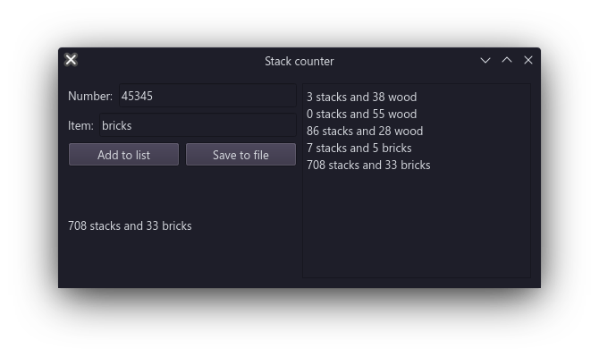

# Simple Stack counter
Basically a simple GUI for calculating stacks useful for Minecraft.

# Setup

You need to have Python and [`pipenv`](https://pipenv.pypa.io/en/latest/#) installed.

To get started, use `pipenv install` to install required deps and then open in virtual shell with `pipenv shell` and run with `python3 main.py`